# 📦 Smart Inventory Management System

A console-based Inventory Management System developed in **C Programming** using **Binary File Handling**.

## ✨ Features

- ➕ Add Product
- 📋 View Products
- 🔍 Search Product by ID
- 🔎 Search Product by Name
- ✏️ Update Product
- 🗑️ Delete Product (with confirmation)
- 📊 Inventory Statistics
- ⚠️ Low Stock Products
- 📄 Generate Inventory Report
- 💾 Binary File Storage
- ✅ Input Validation
- 🚫 Duplicate Product ID Detection

## 🛠️ Technologies Used

- C Programming
- Structures
- Arrays
- Functions
- File Handling
- Binary Files

## 🚀 How to Run

1. Clone the repository

```bash
git clone https://github.com/zebafirdous777-hue/smart-inventory-management-system.git
```

2. Compile

```bash
gcc main.c -o inventory
```

3. Run

```bash
./inventory
```

## 👩‍💻 Author

**Zeba Firdous**

B.E. Computer Science (AI & ML)

Dayananda Sagar Academy of Technology & Management
## 📸 Screenshots

### Main Menu
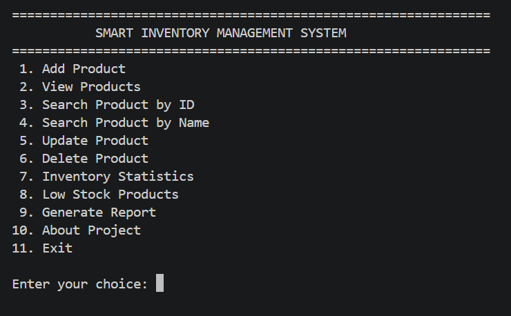

### Add Product
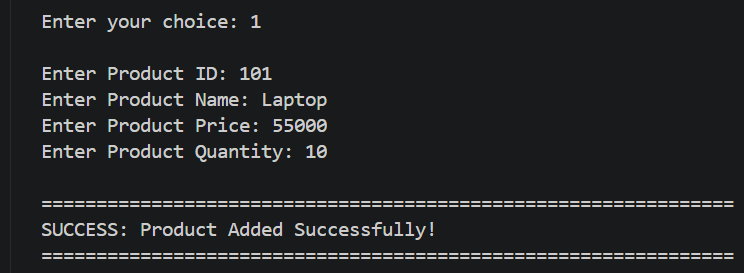

### View Products
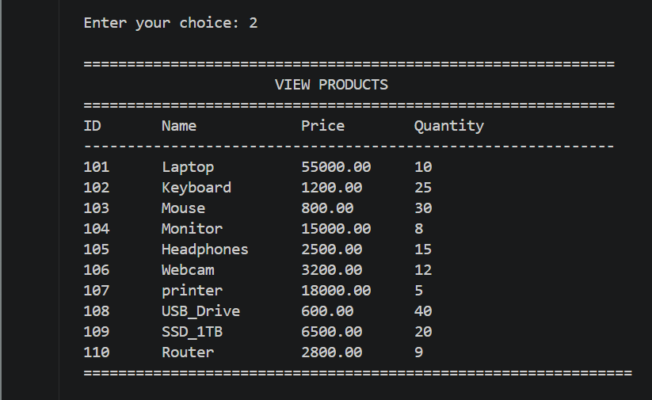

### Search Product by ID
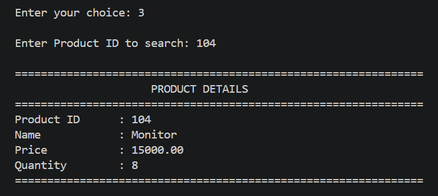

### Search Product by Name
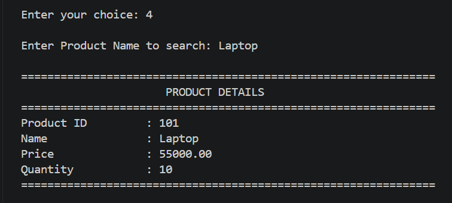

### Update Product
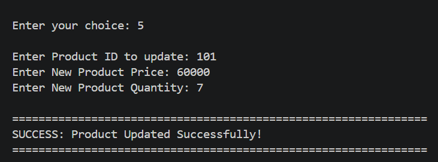

### Delete Product
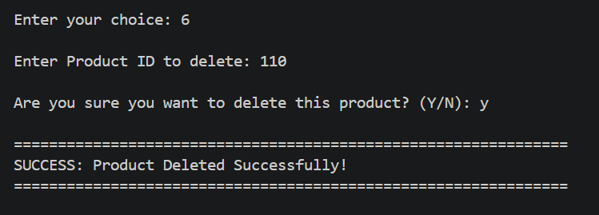

### Inventory Statistics
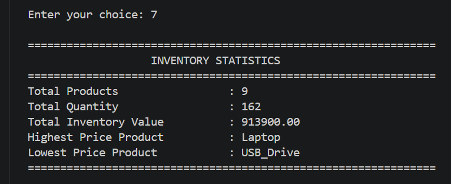

### Low Stock Products
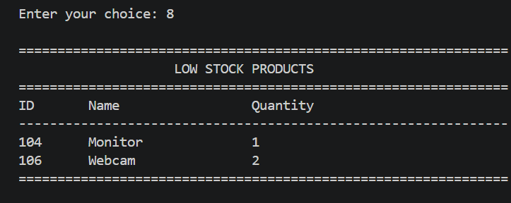

### Generate Report
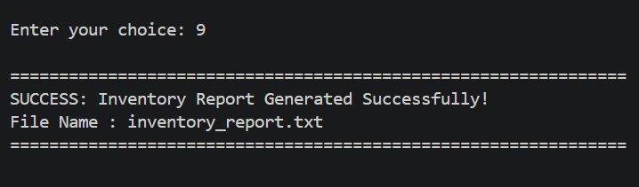

### About Project
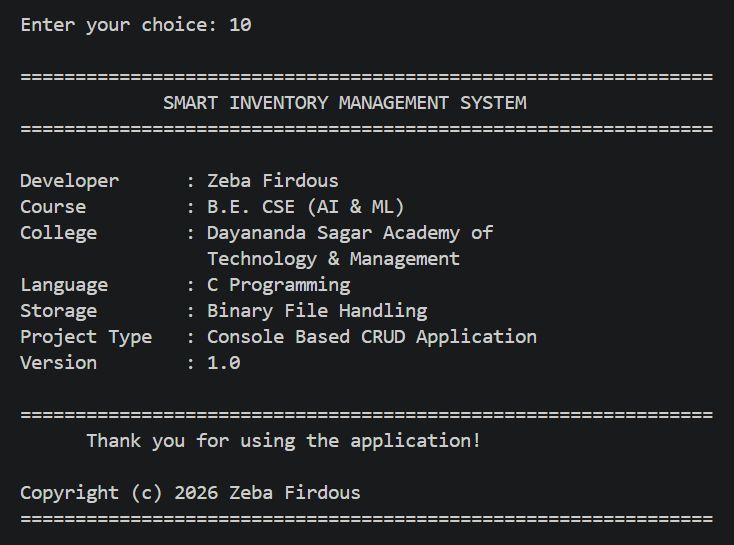
